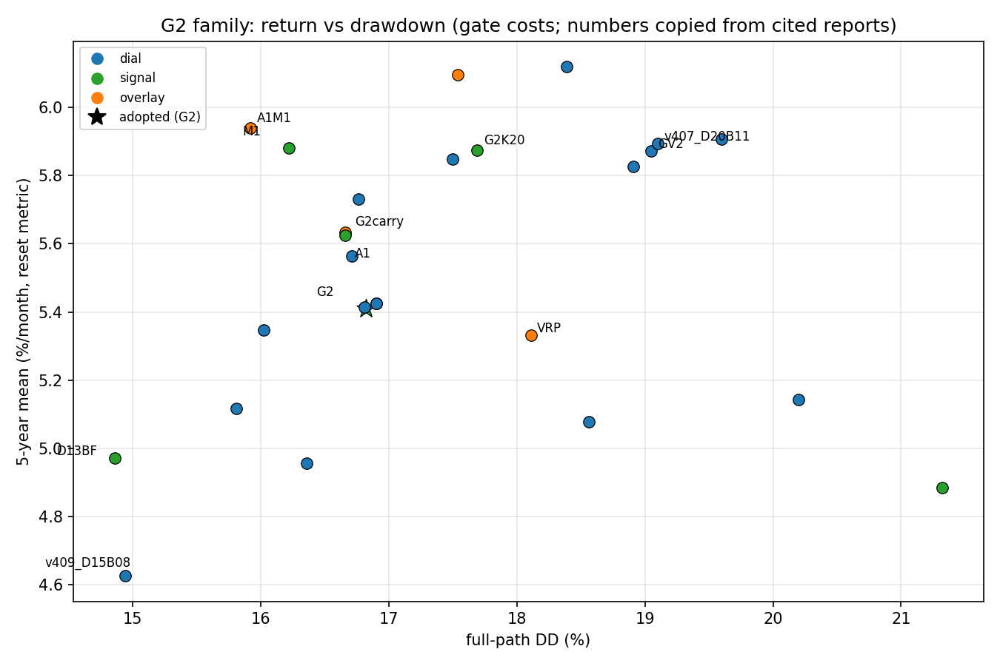

# Bản đồ return–drawdown họ G2 (gate costs, 4-phase 5y)
Số liệu copy nguyên văn từ báo cáo được dẫn; bảng đủ 29 hàng ở `research/diagnostics/docs_frontier/frontier_table.csv`, vẽ bằng script cùng thư mục.

## Bảng rút gọn (5y %/tháng | DD full-path | năm gần nhất | kiểm định)
| id | 5y | DD full | gần nhất | kiểm định |
|---|---|---|---|---|
| G2 (triển khai, ★) | 5.410 | 16.82 | 4.648 | v421 PASS |
| D17BF | 5.425 | 16.90 | 5.060 | v411 PASS |
| D13BF | 4.971 | 14.86 | 4.723 | v424 PASS (không ROBUST.md) |
| G2K20 | 5.874 | 17.69 | 4.716 | v422 PASS; rớt vòng Y4 |
| G2+carry f0.25 | 5.634 | 16.66 | 4.698 | post-hoc, cần prospective |
| G2K20+carry | 6.097 | 17.54 | 4.766 | post-hoc |
| GV3 (tốt nhất họ governor) | 5.849 | 17.50 | 4.824 | REJECT (năm gần nhất < 5) |
| NO_VT | 6.119 | 18.39 | 4.772 | diagnostic |
| NO_GOV | 5.907 | 19.60 | 4.824 | diagnostic, DD ~20 |
| A1 (Amihud) | 5.624 | 16.66 | 4.750 | chọn trên dev4 |
| A1 S5 (Bybit) | 4.884 | 21.32 | — | FAIL (gap ~0, DD > 20) |
| M1 (MVRV) | 5.881 | 16.22 | 4.648 | robust nhưng hòa → không strict |
| A1+M1 post-hoc | 5.939 | 15.92 | 4.750 | tương thích, không phải lựa chọn |
| VRP FULL | 5.332 | 18.11 | 5.025 | REJECT |
| v423_X45 | 5.118 | 15.81 | 4.643 | cả 2 frontier |
| v409_D15B08 (DD thấp nhất) | 4.626 | 14.94 | 4.054 | frontier full-path |
| v407_D20B11 (R cao nhất) | 5.894 | 19.10 | 5.528 | frontier, DD > 19 |
| K2 | (không 5y; dev4 5.772) | 16.09 | 4.801 | REJECT, vắng mặt trên scatter |
1. Các điểm dial thuần (governor GV1–GV3, ablation NO_*/TOUCH, các hàng frontier v399–v407) nằm gần một đường: muốn lợi nhuận 5y cao hơn thì phải chịu DD full-path cao hơn.
2. Điểm rời khỏi đường theo hướng tốt là M1 và A1+M1 (lợi nhuận ~5.9 mà DD chỉ ~16), còn VRP rời theo hướng xấu (lợi nhuận thấp hơn G2 mà DD cao tới 18.11). LƯU Ý (leader): oc_mvrvmech cho thấy phần lợi của M1 KHÔNG đến từ tín hiệu MVRV (tách riêng, cổng MVRV làm book tệ hơn: 2.461 < 2.531) mà từ tương tác với governor theo pha (tránh một lần pha 3 bị tắt 165 thanh đầu 2024) — dựa trên 2 sự kiện và chưa kích hoạt lần nào ở năm gần nhất; A1 thì mất sạch lợi thế và DD > 20 với giá Bybit (S5). Vì vậy cả hai KHÔNG được triển khai.
3. Điểm đang triển khai là G2 vì tái tạo khớp từng chữ số trước mọi overlay, blind audit PASS, DD 16.82 dưới 20 và không năm nào lỗ — mọi biến thể khác đều đo chênh lệch so với nó.
4. Overlay carry (+0.22 điểm/tháng) và các hàng frontier lợi nhuận cao đều là post-hoc trên đúng 5 năm nghiên cứu nên chưa được chọn, cần nhật ký prospective xác nhận.
5. Chủ tài khoản đánh đổi rõ ràng: lấy DD thấp (v409_D15B08 14.94, D13BF 14.86) thì nhận ~4.6–5.0%/tháng, lấy lợi nhuận cao (G2K20+carry 6.10, NO_VT 6.12, v407 5.89) thì DD lên 17.5–19+ và kèm rủi ro quá khớp quá khứ.
Nguồn: v421/v411/v424/v422_audit, oc_carrycompound, oc_g2k20compound, oc_governor, oc_ablation, oc_lit_xs, oc_amihudrobust, oc_lit_position, oc_mvrvrobust, oc_kronoshidden, oc_vrpstrike, oc_frontier.

## Bảng Bybit + carry f=0,25 (oc_levfrontier, 2026-10-08; năm gần nhất là diagnostic có nhãn, S5 y2021 SHORT từ 2021-11-15)
Nguồn số liệu: docs/CLOSED_DIRECTIONS.md hàng `oc_levfrontier` ngày 2026-10-08 và research/tournament/oc_levfrontier/REPORT.md §2 (không số mới).
| hàng (Bybit S5 + carry) | 5y %/tháng | full DD % | worst dev year | năm gần nhất (diag) | bootstrap median %/tháng | P(DD>20 %/năm) |
|---|---|---|---|---|---|---|
| G2 | 5,111 | 17,93 | 2,321 | 4,493 | 5,23 | 11,2 % |
| G2+C2 | 5,342 | 16,35 | 2,405 | 4,607 | 5,42 | 10,6 % |
| G2+B7 | 6,127 | 19,72 | 2,391 | 4,719 | 6,08 | 15,7 % |
| G2+B7xC2 | 5,910 | 17,28 | 2,445 | 4,707 | 5,87 | 16,5 % |
| G2K20 | 5,567 | 19,02 | 2,529 | 4,544 | 5,58 | 14,5 % |
| G2K20+C2 (pick robust dev4 trên Bybit+carry: worst-year cao nhất) | 5,593 | 17,78 | 2,539 | 4,619 | 5,66 | 14,0 % |
| G2K20+B7 | 6,345 | 23,72 (vỡ DD) | 1,867 | 4,756 | 6,21 | 21,7 % |
| G2K20+B7xC2 | 6,144 | 18,48 | 2,145 | 4,787 | 5,85 | 21,9 % |
Pick robust dev4 trên Bybit+carry là G2K20+C2 (dev4 5,838 / W 2,539 / DD 17,80). KHÔNG hàng nào đạt >= 5 %/tháng ở năm gần nhất trên Bybit (cao nhất 4,787 G2K20+B7xC2; pick chỉ 4,619; G2+B7 4,719).

Điểm frontier Binance C2 / B7 (oc_c2frontier, oc_cascadeboost, oc_b7c2, oc_b7frontier; REPORT.md của từng hướng, không số mới):
- oc_c2frontier Binance 5y / full DD: D13BF 4,971 / 14,86 -> +C2 5,222 / 14,91 (góc DD<15 mới, max yearly DD 15,62); G2 5,410 / 16,82 -> +C2 5,542 / 15,42; G2K20 5,874 / 17,69 -> +C2 5,983 / 16,24 (dev4 mean 6,275, WORST 2,982 cao nhất mọi hàng; năm sạch 4,826). Bybit S5: D13BF 4,482 / 15,95 -> +C2 4,795 / 15,61 (năm sạch -0,021) -> không hàng nào vừa 5y >= 5 vừa DD < 15 trên Bybit.
- oc_cascadeboost (nhiễm): dev4 B7 6,738 / WORST 2,955 / DD 17,92 (B3 6,330 / 2,597 / 18,05; REF 5,601 / 2,588 / 16,91) -> pick B7; 5y 6,364; năm post-release 4,88 (có nhãn); đoạn 1m-marked xấu nhất 2023-04-17 .. 06-14 sâu 17,75 %.
- oc_b7c2: dev4 Binance B7 6,738 / W 2,955 / DD 17,92; B7C2 6,652 / 2,922 / 17,05; cap 6,501 / 2,874 / 17,04 -> pick B7. Bybit S5: B7 5y 5,906 / full DD 20,31 (vỡ); B7C2 5,685 / 17,43 (dev4 5,944 / W 2,253 / DD 17,56; worst-year trên B7 2,200 và REF 2,129); cap 5,596 / 17,41. Post-release (có nhãn) B7C2 4,99 base / 4,657 Bybit -> C2 gỡ ~2,9pp full-path DD Bybit của B7 với giá -0,22 %/tháng.
- oc_b7frontier: D13BF không có gross cap nên D13BF+B7 vỡ DD (dev4 20,54 base / 22,33 Bybit; Bybit+carry 5,349 / full DD 21,21, P(DD>20 %/năm) 27 %). G2+B7+carry trên Bybit: dev4 6,482 / W 2,391 / DD 18,93; 5y 6,127; full DD 19,72; recent (có nhãn) 4,719; bootstrap median 6,08 %/tháng, P(tháng >= 5 %) 64,8 %, P(DD>20 %/năm) 15,7 %, P(năm lỗ) 0,6 % (so với G2+carry 5,111 / 17,93, P(DD>20) 11,2 %) -> chính gross cap mới giữ B7 khỏi vỡ crash.

Ghi chú tiếng Việt (không số mới, từ các hàng 2026-10-08):
- C2 là overlay timing gần như sạch: blind audit audit_c2 PASS exact (fit blind bit-identical; dev4 5,739 / W 2,711 / DD 15,48; năm sạch 4,754; 5y 5,542; full DD 15,42; 200 lần tính lại ch_q10 cắt ngắn lệch tối đa 4,2e-05; corpus huấn luyện Chronos-Bolt không có chuỗi crypto nào) -> dev 2021-2024 gần như sạch.
- B7 nhiễm và chủ yếu là exposure: oc_cboostctrl cho thấy exposure giải thích 74 % (so với CTRL_C 6,441 / 2,940 / 18,33) / 67 % (so với CTRL_R mean 6,359, p5 6,16 / p95 6,49, DD 18,07) mức tăng dev4 của B7 (6,738 / 2,955 / 17,92 so với REF 5,601 / 2,588 / 16,91), timing chỉ còn ~0,3 %/tháng; B7 chỉ vượt p95 ngẫu nhiên đúng 1/4 năm dev (2023).
- Chính gross cap 2,0 giữ B7 trong DD 20: D13BF+B7 không cap vỡ DD ngay trên dev4 (20,54 base / 22,33 Bybit; Bybit+carry full DD 21,21), còn G2+B7+carry (có cap) full DD 19,72; G2K20+B7 (kd 2,0 x boost) vỡ 23,72.
- Không hàng nào đạt 5 %/tháng ở năm gần nhất trên Bybit (kể cả kèm carry): cao nhất 4,787 (G2K20+B7xC2), pick robust 4,619, G2+B7 4,719, G2 4,493, G2+C2 4,607.
